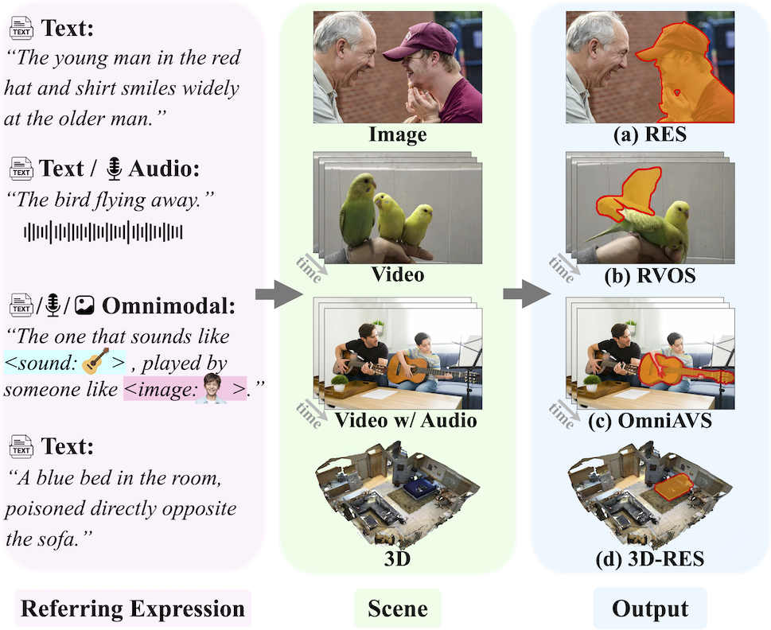
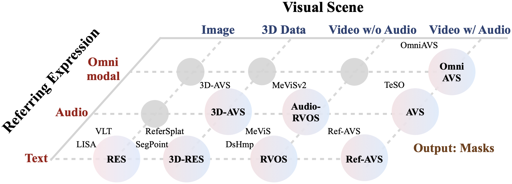

[](https://github.com/sindresorhus/awesome)
[](https://github.com/henghuiding/Awesome-Multimodal-Referring-Segmentation/pulls)
<br />

<p align="center">
  <h1 align="center">Multimodal Referring Segmentation: A Survey</h1>
  <p align="center">
    <!-- arXiv, 2024 -->
    <!-- <br /> -->
    <a href="https://henghuiding.com/"><strong>Henghui Ding</strong></a>
    ·
    <a href="https://github.com/songtang209"><strong>Song Tang</strong></a>
    ·
    <a href="https://heshuting555.github.io"><strong>Shuting He</strong></a>
    ·
    <a href="https://scholar.google.be/citations?user=XlQP0GIAAAAJ&hl=en"><strong>Chang Liu</strong></a>
    ·
    <a href="https://zxwu.azurewebsites.net"><strong>Zuxuan Wu</strong></a>
    ·
    <a href="https://scholar.google.com/citations?user=f3_FP8AAAAAJ&hl=en"><strong>Yu-Gang Jiang</strong></a>


  </p>


  <p align="center">
    <a href="https://arxiv.org/abs/2508.00265">
      
    </a>
  </p>


<p align="center">
  
</p>


**An Illustration of Multimodal Referring Segmentation Tasks.**

<p align="center">
  


</p>

**An Illustration of Multimodal Referring Segmentation Representative Works.**

### 🔥 Add Your Paper in our Repo and Survey!

- We welcome contributions to enhance the comprehensiveness of this survey. If you identify any omitted works or wish to suggest additional papers, implementations, or resources, please submit a [pull request](). All relevant contributions will be promptly reviewed and incorporated.

- **Note:** While we strive for comprehensive coverage, the vast number of papers on arXiv makes it impractical to include every work in our survey. Nevertheless, we encourage researchers to submit pull requests with their work for potential inclusion in future survey versions.


### 🔥 New


### 🔥 Highlight!!


## Table of contents

1. [Referring Expression Segmentation (RES)](#1-referring-expression-segmentation-res)
2. [Referring Video-Object Segmentation (RVOS)](#2-referring-video-object-segmentation-rvos)
3. [Referring Audio-Visual Segmentation (RAVS)](#3-referring-audio-visual-segmentation-ravs)
4. [3D Referring Expression Segmentation (3D-RES)](#4-3d-referring-expression-segmentation-3d-res)
5. [Generalized Referring Expression x (GREx)](#5-generalized-referring-expression-x-grex)
6. [Application](#6-application)

## 1. Referring Expression Segmentation (RES)

| Title                                                        | Source                                                       | Code / Homepage                                              |
| ------------------------------------------------------------ | ------------------------------------------------------------ | ------------------------------------------------------------ |
| **[X-SAM]**[X-SAM: From Segment Anything to Any Segmentation](https://arxiv.org/abs/2508.04655) |  | [](https://github.com/wanghao9610/X-SAM) |
| **[Seg-R1]**[Seg-R1: Segmentation Can Be Surprisingly Simple with Reinforcement Learning](http://arxiv.org/abs/2506.22624) |  |                                                              |
| **[ELBO-T2IAlign]**[ELBO-T2IAlign: A Generic ELBO-Based Method for Calibrating Pixel-level Text-Image Alignment in Diffusion Models](http://arxiv.org/abs/2506.09740) |  |                                                              |
| **[MBA]**[MBA: Multimodal Bidirectional Attack for Referring Expression Segmentation Models](http://arxiv.org/abs/2506.16157) |  |                                                              |
| **[FOCUS]**[FOCUS: Unified Vision-Language Modeling for Interactive Editing Driven by Referential Segmentation](http://arxiv.org/abs/2506.16806) |  |                                                              |
| **[NWPU-Refer]**[A Large-Scale Referring Remote Sensing Image Segmentation Dataset and Benchmark](http://arxiv.org/abs/2506.03583) |  | [](https://github.com/CVer-Yang/NWPU-Refer) |
| **[SegVLM]**[Deformable Attentive Visual Enhancement for Referring Segmentation Using Vision-Language Model](http://arxiv.org/abs/2505.19242) |  |                                                              |
| **[RemoteSAM]** [RemoteSAM: Towards Segment Anything for Earth Observation](http://arxiv.org/abs/2505.18022) |  | [](https://github.com/1e12Leon/RemoteSAM) |
| **[LISAT]** [LISAT: Language-Instructed Segmentation Assistant for Satellite Imagery](http://arxiv.org/abs/2505.02829) |  | [Homepage](https://lisat-bair.github.io/LISAt/)              |
| **[PRS-Med]** [PRS-Med: Position Reasoning Segmentation with Vision-Language Model in Medical Imaging](http://arxiv.org/abs/2505.11872) |  |                                                              |
| **[RVTBench]** [RVTBench: A Benchmark for Visual Reasoning Tasks](http://arxiv.org/abs/2505.11838) |  | [](https://github.com/yiqings/rvt) |
| **[SAM-R1]** [SAM-R1: Leveraging SAM for Reward Feedback in Multimodal Segmentation via Reinforcement Learning](http://arxiv.org/abs/2505.22596) |  |                                                              |
| **[VisionReasoner]** [VisionReasoner: Unified Visual Perception and Reasoning via Reinforcement Learning](http://arxiv.org/abs/2505.12081) |  | [](https://github.com/dvlab-research/VisionReasoner) |
| **[ReasoningSeg Survey]** [Reasoning Segmentation for Images and Videos: A Survey](http://arxiv.org/abs/2505.18816) |  |                                                              |
| **[PixelThink]** [PixelThink: Towards Efficient Chain-of-Pixel Reasoning](http://arxiv.org/abs/2505.23727) |  |                                                              |
| **[SynRES]** [SynRES: Towards Referring Expression Segmentation in the Wild via Synthetic Data](http://arxiv.org/abs/2505.17695) |  | [](https://github.com/UTLLab/SynRES) |
| **[RESAnything]** [RESAnything: Attribute Prompting for Arbitrary Referring Segmentation](http://arxiv.org/abs/2505.02867) |  | [Homepage](https://suikei-wang.github.io/RESAnything/)       |
| **[Pixel-SAIL]** [Pixel-SAIL: Single Transformer For Pixel-Grounded Understanding](http://arxiv.org/abs/2504.10465) |  | [](https://github.com/magic-research/Sa2VA) |
| **[LVLM_CSP]** [LVLM_CSP: Accelerating Large Vision Language Models via Clustering, Scattering, and Pruning for Reasoning Segmentation](http://arxiv.org/abs/2504.10854) |  |                                                              |
| **[SegEarth-R1]** [SegEarth-R1: Geospatial Pixel Reasoning via Large Language Model](http://arxiv.org/abs/2504.09644) |  | [](https://github.com/earth-insights/SegEarth-R1) |
| **[UniRES++]** [Towards Unified Referring Expression Segmentation Across Omni-Level Visual Target Granularities](http://arxiv.org/abs/2504.01954) |  | [](https://github.com/Rubics-Xuan/MRES) |
| **[MediSee]** [MediSee: Reasoning-based Pixel-level Perception in Medical Images](http://arxiv.org/abs/2504.11008) |  | [](https://github.com/Edisonhimself/MediSee) |
| **[PLVL]** [Progressive Language-guided Visual Learning for Multi-Task Visual Grounding](http://arxiv.org/abs/2504.16145) |  | [](https://github.com/jcwang0602/PLVL) |
| **[UFO]** [UFO: A Unified Approach to Fine-grained Visual Perception via Open-ended Language Interface](http://arxiv.org/abs/2503.01342) |  | [](https://github.com/nnnth/UFO) |
| **[GroundingSuite]** [GroundingSuite: Measuring Complex Multi-Granular Pixel Grounding](http://arxiv.org/abs/2503.10596) |  | [](https://github.com/hustvl/GroundingSuite) |
| **[UniVG]** [UniVG: A Generalist Diffusion Model for Unified Image Generation and Editing](http://arxiv.org/abs/2503.12652) |  |                                                              |
| **[AURA]** [Unveiling the Invisible: Reasoning Complex Occlusions Amodally with AURA](http://arxiv.org/abs/2503.10225) |  |                                                              |
| **[Seg-Zero]** [Seg-Zero: Reasoning-Chain Guided Segmentation via Cognitive Reinforcement](http://arxiv.org/abs/2503.06520) |  | [](https://github.com/dvlab-research/Seg-Zero) |
| **[AeroReformer]** [AeroReformer: Aerial Referring Transformer for UAV-based Referring Image Segmentation](http://arxiv.org/abs/2502.16680) |  | [](https://github.com/lironui/AeroReformer) |
| **[PixFoundation]** [PixFoundation: Are We Heading in the Right Direction with Pixel-level Vision Foundation Models?](http://arxiv.org/abs/2502.04192) |  | [](https://github.com/MSiam/PixFoundation/) |
| **[MIRAS]** [Pixel-Level Reasoning Segmentation via Multi-turn Conversations](http://arxiv.org/abs/2502.09447) |  | [](https://github.com/ccccai239/PixelRIST) |
| **[NegRefCOCOg & NegationCLIP]** [Know "No" Better: A Data-Driven Approach for Enhancing Negation Awareness in CLIP](http://arxiv.org/abs/2501.10913) |  |                                                              |
| **[DETRIS]** [Densely Connected Parameter-Efficient Tuning for Referring Image Segmentation](http://arxiv.org/abs/2501.08580) |  | [](https://github.com/jiaqihuang01/DETRIS) |
| **[MVP-LM]**[Advancing Visual Large Language Model for Multi-granular Versatile Perception](http://arxiv.org/abs/2507.16213) |  | [](https://github.com/xiangwentao666/MVP-LM) |
| **[DeRIS]**[DeRIS: Decoupling Perception and Cognition for Enhanced Referring Image Segmentation through Loopback Synergy](http://arxiv.org/abs/2507.01738) |  | [](https://github.com/Dmmm1997/DeRIS) |
| **[RGA3]**[Object-centric Video Question Answering with Visual Grounding and Referring](https://arxiv.org/abs/2507.19599) |  | [Homepage](https://qirui-chen.github.io/RGA3-release/)       |
| **[SegAgent]** [SegAgent: Exploring Pixel Understanding Capabilities in MLLMs by Imitating Human Annotator Trajectories](https://arxiv.org/abs/2503.08625) |  | [](https://github.com/aim-uofa/SegAgent) |
| **[HybridGL]** [Hybrid Global-Local Representation with Augmented Spatial Guidance for Zero-Shot Referring Image Segmentation](http://arxiv.org/abs/2504.00356) |  | [](https://github.com/fhgyuanshen/HybridGL) |
| **[READ]** [Reasoning to Attend: Try to Understand How <SEG> Token Works](http://arxiv.org/abs/2412.17741) |  | [](https://github.com/rui-qian/READ) |
| **[WeakMCN]** [WeakMCN: Multi-task Collaborative Network for Weakly Supervised Referring Expression Comprehension and Segmentation](https://openaccess.thecvf.com/content/CVPR2025/papers/Cheng_WeakMCN_Multi-task_Collaborative_Network_for_Weakly_Supervised_Referring_Expression_Comprehension_CVPR_2025_paper.pdf) |  | [](https://github.com/MRUIL/WeakMCN) |
| **[MIMO]** [MIMO: A Medical Vision Language Model with Visual Referring Multimodal Input and Pixel Grounding Multimodal Output](https://openaccess.thecvf.com/content/CVPR2025/papers/Chen_MIMO_A_Medical_Vision_Language_Model_with_Visual_Referring_Multimodal_CVPR_2025_paper.pdf) |  | [](https://github.com/pkusixspace/MIMO) |
| **[DViN]** [DViN: Dynamic Visual Routing Network for Weakly Supervised Referring Expression Comprehension](https://openaccess.thecvf.com/content/CVPR2025/papers/Chen_DViN_Dynamic_Visual_Routing_Network_for_Weakly_Supervised_Referring_Expression_CVPR_2025_paper.pdf) |  | [](https://github.com/XxFChen/DViN) |
| **[POPEN]** [POPEN: Preference-Based Optimization and Ensemble for LVLM-Based Reasoning Segmentation](http://arxiv.org/abs/2504.00640) |  | [Homepage](https://lanyunzhu.site/POPEN/)                    |
| **[ADDP]** [Aligning Generative Denoising with Discriminative Objectives Unleashes Diffusion for Visual Perception](http://arxiv.org/abs/2504.11457) |  | [](https://github.com/ziqipang/ADDP) |
| **[MMR]** [MMR: A Large-scale Benchmark Dataset for Multi-target and Multi-granularity Reasoning Segmentation](http://arxiv.org/abs/2503.13881) |  | [](https://github.com/jdg900/MMR) |
| **[SegLLM]** [SegLLM: Multi-round Reasoning Segmentation](http://arxiv.org/abs/2410.18923) |  | [Homepage](https://berkeley-hipie.github.io/segllm.github.io) |
| **[Text4Seg]** [Text4Seg: Reimagining Image Segmentation as Text Generation](http://arxiv.org/abs/2410.09855) |  | [Homepage](https://mc-lan.github.io/Text4Seg/)               |
| **[Segment Anyword]** [Segment Anyword: Mask Prompt Inversion for Open-Set Grounded Segmentation](http://arxiv.org/abs/2505.17994) |  | [Homepage](https://zhihualiued.github.io/segment_anyword/)   |
| **[IteRPrimE]** [IteRPrimE: Zero-shot Referring Image Segmentation with Iterative Grad-CAM Refinement and Primary Word Emphasis](http://arxiv.org/abs/2503.00936) |  | [](https://github.com/VoyageWang/IteRPrimE) |
| **[PRIMA]** [PRIMA: Multi-Image Vision-Language Models for Reasoning Segmentation](http://arxiv.org/abs/2412.15209) |  |                                                              |
| **[MaTTR]**[Mask-aware Text-to-Image Retrieval: Referring Expression Segmentation Meets Cross-modal Retrieval](https://arxiv.org/abs/2506.22864) |  |                                                              |
| **[RSVP]** [RSVP: Reasoning Segmentation via Visual Prompting and Multi-modal Chain-of-Thought](http://arxiv.org/abs/2506.04277) |  |                                                              |
| **[RESMatch]** [RESMatch: Referring Expression Segmentation in a Semi-Supervised Manner](http://arxiv.org/abs/2402.05589) |  |                                                              |
| **[FIANet]** [Exploring Fine-Grained Image-Text Alignment for Referring Remote Sensing Image Segmentation](http://arxiv.org/abs/2409.13637) |  | [](https://github.com/Shaosifan/FIANet) |
| **[InstructSeg]** [InstructSeg: Unifying Instructed Visual Segmentation with Multi-modal Large Language Models](http://arxiv.org/abs/2412.14006) |  | [](https://github.com/congvvc/InstructSeg) |
| **[MaskRIS]** [MaskRIS: Semantic Distortion-aware Data Augmentation for Referring Image Segmentation](http://arxiv.org/abs/2411.19067) |  | [](https://github.com/naver-ai/maskris) |
| **[CroBIM]** [Cross-Modal Bidirectional Interaction Model for Referring Remote Sensing Image Segmentation](http://arxiv.org/abs/2410.08613) |  | [](https://github.com/HIT-SIRS/CroBIM) |
| **[PVP]** [How Well Can Vision Language Models See Image Details?](http://arxiv.org/abs/2408.03940) |  |                                                              |
| **[EAVL]** [EAVL: Explicitly Align Vision and Language for Referring Image Segmentation](http://arxiv.org/abs/2308.09779) |  |                                                              |
| **[Shared-RIS]** [A Simple Baseline with Single-encoder for Referring Image Segmentation](http://arxiv.org/abs/2408.15521) |  | [](https://github.com/Seonghoon-Yu/Shared-RIS) |
| **[EVF-SAM]** [EVF-SAM: Early Vision-Language Fusion for Text-Prompted Segment Anything Model](http://arxiv.org/abs/2406.20076) |  | [](https://github.com/hustvl/EVF-SAM) |
| **[S2RM]** [Spatial Semantic Recurrent Mining for Referring Image Segmentation](http://arxiv.org/abs/2405.09006) |  |                                                              |
| **[LaSagnA]** [LaSagnA: Language-based Segmentation Assistant for Complex Queries](http://arxiv.org/abs/2404.08506) |  | [](https://github.com/congvvc/LaSagnA) |
| **[LLaVASeg]** [Empowering Segmentation Ability to Multi-modal Large Language Models](http://arxiv.org/abs/2403.14141) |  |                                                              |
| **[BSAP]** [Towards Alleviating Text-to-Image Retrieval Hallucination for CLIP in Zero-shot Learning](http://arxiv.org/abs/2402.18400) |  |                                                              |
| **[GELLA]** [Generalizable Entity Grounding via Assistance of Large Language Model](http://arxiv.org/abs/2402.02555) |  |                                                              |
| **[CPRN]** [Collaborative Position Reasoning Network for Referring Image Segmentation](http://arxiv.org/abs/2401.11775) |  |                                                              |
| **[Grounded SAM]** [Grounded SAM: Assembling Open-World Models for Diverse Visual Tasks](http://arxiv.org/abs/2401.14159) |  | [](https://github.com/IDEA-Research/Grounded-Segment-Anything) |
| **[F-LMM]** [F-LMM: Grounding Frozen Large Multimodal Models](http://arxiv.org/abs/2406.05821) |  | [](https://github.com/wusize/F-LMM) |
| **[SESAME]** [See Say and Segment: Teaching LMMs to Overcome False Premises](https://openaccess.thecvf.com/content/CVPR2024/papers/Wu_See_Say_and_Segment_Teaching_LMMs_to_Overcome_False_Premises_CVPR_2024_paper.pdf) |  | [](https://github.com/see-say-segment/sesame) |
| **[LQMFormer]** [LQMFormer: Language-aware Query Mask Transformer for Referring Image Segmentation](https://openaccess.thecvf.com/content/CVPR2024/papers/Shah_LQMFormer_Language-aware_Query_Mask_Transformer_for_Referring_Image_Segmentation_CVPR_2024_paper.pdf) |  |                                                              |
| **[PerceptionGPT]** [PerceptionGPT: Effectively Fusing Visual Perception into LLM](https://openaccess.thecvf.com/content/CVPR2024/papers/Pi_PerceptionGPT_Effectively_Fusing_Visual_Perception_into_LLM_CVPR_2024_paper.pdf) |  | [](https://github.com/pipilurj/perceptionGPT) |
| **[PixelLM]** [PixelLM: Pixel Reasoning with Large Multimodal Model](http://arxiv.org/abs/2312.02228) |  | [Homepage](https://pixellm.github.io)                        |
| **[Osprey]** [Osprey: Pixel Understanding with Visual Instruction Tuning](http://arxiv.org/abs/2312.10032) |  | [](https://github.com/CircleRadon/Osprey) |
| **[GLaMM]** [GLaMM: Pixel Grounding Large Multimodal Model](http://arxiv.org/abs/2311.03356) |  | [](https://github.com/mbzuai-oryx/groundingLMM) |
| **[RMSIN]** [Rotated Multi-Scale Interaction Network for Referring Remote Sensing Image Segmentation](https://ieeexplore.ieee.org/document/10657655/) |  | [](https://github.com/Lsan2401/RMSIN) |
| **[CaR]** [CLIP as RNN: Segment Countless Visual Concepts without Training Endeavor](https://ieeexplore.ieee.org/document/10657273/) |  | [](https://github.com/kevin-ssy/CLIP_as_RNN) |
| **[GeoChat]** [GeoChat: Grounded Large Vision-Language Model for Remote Sensing](https://arxiv.org/abs/2311.15826) |  | [](https://github.com/mbzuai-oryx/GeoChat) |
| **[PPT]** [Curriculum Point Prompting for Weakly-Supervised Referring Image Segmentation](http://arxiv.org/abs/2404.11998) |  |                                                              |
| **[Prompt-RIS]** [Prompt-Driven Referring Image Segmentation with Instance Contrasting](https://ieeexplore.ieee.org/document/10657777/) |  |                                                              |
| **[AnyRef]** [Multi-modal Instruction Tuned LLMs with Fine-grained Visual Perception](http://arxiv.org/abs/2403.02969) |  |                                                              |
| **[MRES & UniRES & Refcocom]** [Unveiling Parts Beyond Objects:Towards Finer-Granularity Referring Expression Segmentation](http://arxiv.org/abs/2312.08007) |  | [](https://github.com/Rubics-Xuan/MRES) |
| **[GSVA]** [GSVA: Generalized Segmentation via Multimodal Large Language Models](http://arxiv.org/abs/2312.10103) |  | [](https://github.com/LeapLabTHU/GSVA) |
| **[Barleria]** [Barleria: An Efficient Tuning Framework for Referring Image Segmentation](https://iclr.cc/virtual/2024/poster/17498) |  | [](https://github.com/NastrondAd/BarLeRIa) |
| **[OneRef]** [OneRef: Unified One-tower Expression Grounding and Segmentation with Mask Referring Modeling](http://arxiv.org/abs/2410.08021) |  | [](https://github.com/linhuixiao/OneRef) |
| **[PCNet]** [Boosting Weakly-Supervised Referring Image Segmentation via Progressive Comprehension](http://arxiv.org/abs/2410.01544) |  |                                                              |
| **[OMGLLaVA]**[OMG-LLaVA: Bridging Image-level, Object-level, Pixel-level Reasoning and Understanding]() |  |                                                              |
| **[VRSBench]** [VRSBench: A Versatile Vision-Language Benchmark Dataset for Remote Sensing Image Understanding](http://arxiv.org/abs/2406.12384) |  | [](https://github.com/lx709/VRSBench) |
| **[PSALM]** [PSALM: Pixelwise SegmentAtion with Large Multi-Modal Model](http://arxiv.org/abs/2403.14598) |  | [](https://github.com/zamling/PSALM) |
| **[NeMo]** [Finding NeMo: Negative-mined Mosaic Augmentation for Referring Image Segmentation](http://arxiv.org/abs/2411.01494) |  | [Homepage](https://dddonghwa.github.io/NeMo/)                |
| **[CoReS]** [CoReS: Orchestrating the Dance of Reasoning and Segmentation](https://link.springer.com/10.1007/978-3-031-72649-1_11) |  | [](https://github.com/baoxiaoyi/CoReS) |
| **[SAM4MLLM]** [SAM4MLLM: Enhance Multi-Modal Large Language Model for Referring Expression Segmentation](http://arxiv.org/abs/2409.10542) |  | [](https://github.com/AI-Application-and-Integration-Lab/SAM4MLLM) |
| **[Pseudo-RIS]** [Pseudo-RIS: Distinctive Pseudo-supervision Generation for Referring Image Segmentation](http://arxiv.org/abs/2407.07412) |  | [](https://github.com/Seonghoon-Yu/Pseudo-RIS) |
| **[GTMS]** [GTMS: A Gradient-driven Tree-guided Mask-free Referring Image Segmentation Method](https://eccv.ecva.net/virtual/2024/poster/2621) |  | [](https://github.com/eternalld/GTMS) |
| **[ReMamber]** [ReMamber: Referring Image Segmentation with Mamba Twister](http://arxiv.org/abs/2403.17839) |  | [](https://github.com/yyh-rain-song/ReMamber) |
| **[SafaRi]** [SafaRi:Adaptive Sequence Transformer for Weakly Supervised Referring Expression Segmentation](http://arxiv.org/abs/2407.02389) |  | [Homepage](https://sayannag.github.io/safari_eccv2024/)      |
| **[SegVG]** [SegVG: Transferring Object Bounding Box to Segmentation for Visual Grounding](http://arxiv.org/abs/2407.03200) |  | [](https://github.com/WeitaiKang/SegVG) |
| **[SemiRES]** [SAM as the Guide: Mastering Pseudo-Label Refinement in Semi-Supervised Referring Expression Segmentation](https://dl.acm.org/doi/10.5555/3692070.3694386) |  |                                                              |
| **[NExT-Chat]** [NExT-Chat: An LMM for Chat, Detection and Segmentation](http://arxiv.org/abs/2311.04498) |  | [](https://github.com/NExT-ChatV/NExT-Chat) |
| **[LAVT-RS]** [Language-Aware Vision Transformer for Referring Segmentation](https://ieeexplore.ieee.org/document/10694805) |  | [](https://github.com/Yxxxb/LAVT-RS) 
| **[Segment-Select-Correct]** [Segment, Select, Correct: A Framework for Weakly-Supervised Referring Segmentation](http://arxiv.org/abs/2310.13479) |  | [](https://github.com/fgirbal/segment-select-correct) |
| **[yan2024fuse]** [Fuse & Calibrate: A bi-directional Vision-Language Guided Framework for Referring Image Segmentation](http://arxiv.org/abs/2405.11205) |  |                                                              |
| **[VATEX]** [Vision-Aware Text Features in Referring Image Segmentation: From Object Understanding to Context Understanding](http://arxiv.org/abs/2404.08590) |  |                                                              |
| **[HARIS]** [HARIS: Human-Like Attention for Reference Image Segmentation](http://arxiv.org/abs/2405.10707) |  |                                                              |
| **[yan2024calibration]** [Calibration & Reconstruction: Deep Integrated Language for Referring Image Segmentation](http://arxiv.org/abs/2404.08281) |  |                                                              |
| **[DIT-SAM]** [Deep Instruction Tuning for Segment Anything Model](http://arxiv.org/abs/2404.00650) |  | [](https://github.com/wysnzzzz/DIT) |
| **[ASDA]** [Adaptive Selection based Referring Image Segmentation](https://dl.acm.org/doi/10.1145/3664647.3680850) |  | [](https://github.com/swagger-coder/ASDA) |
| **[DANet]** [Rethinking the Implicit Optimization Paradigm with Dual Alignments for Referring Remote Sensing Image Segmentation](https://dl.acm.org/doi/10.1145/3664647.3681318) |  |                                                              |
| **[PTQ4RIS]** [PTQ4RIS: Post-Training Quantization for Referring Image Segmentation](http://arxiv.org/abs/2409.17020) |  | [](https://github.com/gugu511yy/PTQ4RIS) |
| **[CLIPU2Net]** [Robot Manipulation in Salient Vision through Referring Image Segmentation and Geometric Constraints](http://arxiv.org/abs/2409.11518) |  |                                                              |
| **[ETRG]** [A Parameter-Efficient Tuning Framework for Language-guided Object Grounding and Robot Grasping](http://arxiv.org/abs/2409.19457) |  | [Homepage](https://sites.google.com/umn.edu/etog-etrg/home)  |
| **[CLIPUNetr]** [CLIPUNetr: Assisting Human-robot Interface for Uncalibrated Visual Servoing Control with CLIP-driven Referring Expression Segmentation](http://arxiv.org/abs/2309.09183) |  |                                                              |
| **[OPT-RSVG]** [Language-Guided Progressive Attention for Visual Grounding in Remote Sensing Images](https://ieeexplore.ieee.org/document/10584552/?arnumber=10584552) |  | [](https://github.com/like413/OPT-RSVG) |
| **[LQVG]** [Language Query-Based Transformer With Multiscale Cross-Modal Alignment for Visual Grounding on Remote Sensing Images](https://ieeexplore.ieee.org/document/10542207/?arnumber=10542207) |  | [](https://github.com/LANMNG/LQVG) |
| **[RRSIS]** [RRSIS: Referring Remote Sensing Image Segmentation](https://ieeexplore.ieee.org/document/10458079/) |  | [](https://github.com/zhu-xlab/rrsis) |
| **[FAN]** [Fully Aligned Network for Referring Image Segmentation](http://arxiv.org/abs/2409.19569) |  |                                                              |
| **[CrossVLT]** [Cross-aware Early Fusion with Stage-divided Vision and Language Transformer Encoders for Referring Image Segmentation](http://arxiv.org/abs/2408.07539) |  | [](https://github.com/yubin1219/CrossVLT) |
| **[SkyScapes]** [Referring Image Segmentation for Remote Sensing Data](https://ieeexplore.ieee.org/document/10642726/) |  |                                                              |
| **[PVD]** [Parallel Vertex Diffusion for Unified Visual Grounding](http://arxiv.org/abs/2303.07216) |  |                                                              |
| **[LLM-Seg]** [LLM-Seg: Bridging Image Segmentation and Large Language Model Reasoning](http://arxiv.org/abs/2404.08767) |  | [](https://github.com/wangjunchi/LLMSeg) |
| **[RIS-CQ]** [Towards Complex-query Referring Image Segmentation: A Novel Benchmark](http://arxiv.org/abs/2309.17205) |  |                                                              |
| **[RISCLIP]** [Extending CLIP's Image-Text Alignment to Referring Image Segmentation](http://arxiv.org/abs/2306.08498) |  |                                                              |
| **[LISA++]** [LISA++: An Improved Baseline for Reasoning Segmentation with Large Language Model](http://arxiv.org/abs/2312.17240) |  | [](https://github.com/dvlab-research/LISA) |
| **[ViLaM]** [Enhancing Visual Grounding and Generalization: A Multi-Task Cycle Training Approach for Vision-Language Models](http://arxiv.org/abs/2311.12327) |  |                                                              |
| **[BTMAE]** [Synchronizing Vision and Language: Bidirectional Token-Masking AutoEncoder for Referring Image Segmentation](http://arxiv.org/abs/2311.17952) |  |                                                              |
| **[MARIS]** [MARIS: Referring Image Segmentation via Mutual-Aware Attention Features](http://arxiv.org/abs/2311.15727) |  |                                                              |
| **[Ref-Diff]** [Ref-Diff: Zero-shot Referring Image Segmentation with Generative Models](http://arxiv.org/abs/2308.16777) |  | [](https://github.com/kodenii/Ref-Diff) |
| **[MMNet]** [MMNet: Multi-Mask Network for Referring Image Segmentation](http://arxiv.org/abs/2305.14969) |  |                                                              |
| **[LGFormer]** [Linguistic Query-Guided Mask Generation for Referring Image Segmentation](http://arxiv.org/abs/2301.06429) |  |                                                              |
| **[rewatbowornwong2023zero]** [Zero-guidance Segmentation Using Zero Segment Labels](http://arxiv.org/abs/2303.13396) |  | [](https://github.com/nessessence/ZeroGuidanceSeg) |
| **[VPD]** [Unleashing Text-to-Image Diffusion Models for Visual Perception](https://ieeexplore.ieee.org/document/10377753/) |  | [](https://github.com/melvinsevi/MVA-Project-Unleashing-Text-to-Image-Diffusion-Models-for-Visual-Perception) |
| **[ETRIS]** [Bridging Vision and Language Encoders: Parameter-Efficient Tuning for Referring Image Segmentation](http://arxiv.org/abs/2307.11545) |  | [](https://github.com/kkakkkka/ETRIS) |
| **[SaG]** [Shatter and Gather: Learning Referring Image Segmentation with Text Supervision](http://arxiv.org/abs/2308.15512) |  | [](https://github.com/kdwonn/SaG) |
| **[weakly-ris]** [Weakly Supervised Referring Image Segmentation with Intra-Chunk and Inter-Chunk Consistency](https://ieeexplore.ieee.org/document/10378440/) |  |                                                              |
| **[TRIS]** [Referring Image Segmentation Using Text Supervision](http://arxiv.org/abs/2308.14575) |  | [](https://github.com/fawnliu/TRIS) |
| **[Partial-RES]** [Learning To Segment Every Referring Object Point by Point](https://openaccess.thecvf.com/content/CVPR2023/papers/Qu_Learning_To_Segment_Every_Referring_Object_Point_by_Point_CVPR_2023_paper.pdf) |  | [](https://github.com/qumengxue/Partial-RES) |
| **[MCRES]** [Meta Compositional Referring Expression Segmentation](https://ieeexplore.ieee.org/document/10204873/) |  |                                                              |
| **[CGFormer]** [Contrastive Grouping with Transformer for Referring Image Segmentation](https://ieeexplore.ieee.org/document/10203670/) |  | [](https://github.com/SooLab/CGFormer) |
| **[MagNet]** [Mask Grounding for Referring Image Segmentation](http://arxiv.org/abs/2312.12198) |  | [Homepage](https://yxchng.github.io/projects/mask-grounding/) |
| **[VG-LAW]** [Language Adaptive Weight Generation for Multi-task Visual Grounding](http://arxiv.org/abs/2306.04652) |  | [](https://github.com/dcdcvgroup/vglaw-mindspore) |
| **[Peekaboo]** [Peekaboo: Text to Image Diffusion Models are Zero-Shot Segmentors](http://arxiv.org/abs/2211.13224) |  | [](https://github.com/RyannDaGreat/peekaboo) |
| **[GLEE]** [General Object Foundation Model for Images and Videos at Scale](http://arxiv.org/abs/2312.09158) |  | [](https://github.com/FoundationVision/GLEE) |
| **[UNINEXT]** [Universal Instance Perception as Object Discovery and Retrieval](https://ieeexplore.ieee.org/document/10205057/) |  | [](https://github.com/MasterBin-IIAU/UNINEXT) |
| **[X-Decoder]** [Generalized Decoding for Pixel, Image, and Language](https://openaccess.thecvf.com/content/CVPR2023/papers/Zou_Generalized_Decoding_for_Pixel_Image_and_Language_CVPR_2023_paper.pdf) |  | [](https://github.com/microsoft/X-Decoder) |
| **[PolyFormer]** [PolyFormer: Referring Image Segmentation as Sequential Polygon Generation](https://ieeexplore.ieee.org/document/10204015/) |  | [](https://github.com/amazon-science/polygon-transformer) |
| **[LISA]** [LISA: Reasoning Segmentation via Large Language Model](http://arxiv.org/abs/2308.00692) |  | [](https://github.com/dvlab-research/LISA) |
| **[Global-Local CLIP]** [Zero-shot Referring Image Segmentation with Global-Local Context Features](https://ieeexplore.ieee.org/document/10204085/) |  | [](https://github.com/Seonghoon-Yu/Zero-shot-RIS) |
| **[SEEM]** [Segment Everything Everywhere All at Once](http://arxiv.org/abs/2304.06718) |  | [](https://github.com/UX-Decoder/Segment-Everything-Everywhere-All-At-Once) |
| **[BKINet]** [Bilateral Knowledge Interaction Network for Referring Image Segmentation](https://ieeexplore.ieee.org/document/10227590/) |  | [](https://github.com/dhding/BKINet) |
| **[CM-MaskSD]** [CM-MaskSD: Cross-Modality Masked Self-Distillation for Referring Image Segmentation](http://arxiv.org/abs/2305.11481) |  |                                                              |
| **[CARIS]** [CARIS: Context-Aware Referring Image Segmentation](https://dl.acm.org/doi/10.1145/3581783.3612117) |  | [](https://github.com/lsa1997/CARIS) |
| **[CVMN]** [Unsupervised Domain Adaptation for Referring Semantic Segmentation](https://dl.acm.org/doi/10.1145/3581783.3611879) |  | [](https://github.com/asudahkzj/CVMN) |
| **[DIOR & MGVLF]** [RSVG: Exploring Data and Models for Visual Grounding on Remote Sensing Data](https://ieeexplore.ieee.org/document/10056343/?arnumber=10056343) |  | [](https://github.com/ZhanYang-nwpu/RSVG-pytorch) |
| **[WiCo]** [WiCo: Win-win Cooperation of Bottom-up and Top-down Referring Image Segmentation](https://www.ijcai.org/proceedings/2023/71) |  |                                                              |
| **[SLViT]** [SLViT: Scale-Wise Language-Guided Vision Transformer for Referring Image Segmentation](https://www.ijcai.org/proceedings/2023/144) |  | [](https://github.com/NaturalKnight/SLViT) |
| **[JMCELN]** [Referring Image Segmentation via Joint Mask Contextual Embedding Learning and Progressive Alignment Network](https://aclanthology.org/2023.emnlp-main.481) |  |                                                              |
| **[TAS]** [Text Augmented Spatial-aware Zero-shot Referring Image Segmentation](http://arxiv.org/abs/2310.18049) |  |                                                              |
| **[SADLR]** [Semantics-Aware Dynamic Localization and Refinement for Referring Image Segmentation](https://ojs.aaai.org/index.php/AAAI/article/view/25428) |  |                                                              |
| **[MDSM]** [Multimodal Diffusion Segmentation Model for Object Segmentation from Manipulation Instructions](http://arxiv.org/abs/2307.08597) |  |                                                              |
| **[M3Att]** [Multi-Modal Mutual Attention and Iterative Interaction for Referring Image Segmentation](https://ieeexplore.ieee.org/document/10132374/) |  |                                                              |
| **[GraspNet-RIS]** [Towards Generalizable Referring Image Segmentation via Target Prompt and Visual Coherence](http://arxiv.org/abs/2312.00452) |  |                                                              |
| **[Omni-RES]** [Towards Omni-supervised Referring Expression Segmentation](http://arxiv.org/abs/2311.00397) |  | [](https://github.com/nineblu/omni-res) |
| **[PCAN]** [Position-Aware Contrastive Alignment for Referring Image Segmentation](http://arxiv.org/abs/2212.13419) |  |                                                              |
| **[TSEG]** [Weakly-supervised segmentation of referring expressions](https://arxiv.org/abs/2205.04725) |  |                                                              |
| **[SHNet]** [Comprehensive Multi-Modal Interactions for Referring Image Segmentation](http://arxiv.org/abs/2104.10412) |  | [](https://github.com/kanji95/SHNET) |
| **[GroupViT]** [GroupViT: Semantic Segmentation Emerges from Text Supervision](https://ieeexplore.ieee.org/document/9879676/) |  | [](https://github.com/NVlabs/GroupViT) |
| **[CRIS]** [CRIS: CLIP-Driven Referring Image Segmentation](https://ieeexplore.ieee.org/document/9878961/) |  | [](https://github.com/DerrickWang005/CRIS.pytorch) |
| **[ReSTR]** [ReSTR: Convolution-free Referring Image Segmentation Using Transformers](https://ieeexplore.ieee.org/document/9879420/) |  | [](https://github.com/SouthFlame/restr) |
| **[LAVT]** [LAVT: Language-Aware Vision Transformer for Referring Image Segmentation](https://ieeexplore.ieee.org/document/9880242/) |  | [](https://github.com/yz93/LAVT-RIS) |
| **[CLIPSeg]** [Image Segmentation Using Text and Image Prompts](http://arxiv.org/abs/2112.10003) |  | [](https://github.com/timojl/clipseg) |
| **[CoupAlign]** [CoupAlign: Coupling Word-Pixel with Sentence-Mask Alignments for Referring Image Segmentation](https://proceedings.neurips.cc/paper_files/paper/2022/file/5e773d319e310f1e4d695159484143b8-Paper-Conference.pdf) |  |                                                              |
| **[SeqTR]** [SeqTR: A Simple yet Universal Network for Visual Grounding](http://arxiv.org/abs/2203.16265) |  | [](https://github.com/sean-zhuh/SeqTR) |
| **[kesen2022modulating]** [Modulating Bottom-Up and Top-Down Visual Processing via Language-Conditional Filters](http://arxiv.org/abs/2003.12739) |  | [](https://github.com/ilkerkesen/bvpr) |
| **[GeoVG]** [Visual Grounding in Remote Sensing Images](https://dl.acm.org/doi/10.1145/3503161.3548316) |  | [Homepage](https://sunyuxi.github.io/publication/GeoVG)      |
| **[feng2022learning]** [Learning From Box Annotations for Referring Image Segmentation](https://ieeexplore.ieee.org/document/9875225/) |  | [](https://github.com/fengguang94/Weakly-Supervised-RIS) |
| **[ISF]** [Instance-Specific Feature Propagation for Referring Segmentation](https://ieeexplore.ieee.org/document/9745353/) |  |                                                              |
| **[PKS]** [Fully and Weakly Supervised Referring Expression Segmentation with End-to-End Learning](http://arxiv.org/abs/2212.10278) |  |                                                              |
| **[MaIL]** [MaIL: A Unified Mask-Image-Language Trimodal Network for Referring Image Segmentation](http://arxiv.org/abs/2111.10747) |  |                                                              |
| **[BUSNet]** [Bottom-Up Shift and Reasoning for Referring Image Segmentation](https://ieeexplore.ieee.org/document/9577319/) |  | [](https://github.com/incredibleXM/BUSNet) |
| **[LTS]** [Locate then Segment: A Strong Pipeline for Referring Image Segmentation](https://ieeexplore.ieee.org/document/9577715/) |  |                                                              |
| **[EFN]** [Encoder Fusion Network with Co-Attention Embedding for Referring Image Segmentation](https://ieeexplore.ieee.org/document/9578505/) |  | [](https://github.com/fengguang94/CEFNet) |
| **[Referring Transformer]** [Referring Transformer: A One-step Approach to Multi-task Visual Grounding](https://papers.neurips.cc/paper_files/paper/2021/file/a376802c0811f1b9088828288eb0d3f0-Paper.pdf) |  | [](https://github.com/ubc-vision/RefTR) |
| **[GbS]** [Detector-Free Weakly Supervised Grounding by Separation](http://arxiv.org/abs/2104.09829) |  | [](https://github.com/aarbelle/GroundingBySeparation) |
| **[MDETR]** [MDETR -- Modulated Detection for End-to-End Multi-Modal Understanding](http://arxiv.org/abs/2104.12763) |  | [](https://github.com/ashkamath/mdetr) |
| **[VLT]** [Vision-Language Transformer and Query Generation for Referring Segmentation](https://ieeexplore.ieee.org/document/9711171/) |  | [](https://github.com/henghuiding/Vision-Language-Transformer) |
| **[CMPC]** [Cross-Modal Progressive Comprehension for Referring Segmentation](http://arxiv.org/abs/2105.07175) |  | [](https://github.com/spyflying/CMPC-Refseg) |
| **[TV-Net]** [Two-stage Visual Cues Enhancement Network for Referring Image Segmentation](https://dl.acm.org/doi/10.1145/3474085.3475222) |  | [](https://github.com/sxjyjay/tv-net) |
| **[CMPC]** [Referring Image Segmentation via Cross-Modal Progressive Comprehension](https://ieeexplore.ieee.org/document/9156414/) |  | [](https://github.com/spyflying/CMPC-Refseg) |
| **[BRINet]** [Bi-directional Relationship Inferring Network for Referring Image Segmentation](https://ieeexplore.ieee.org/document/9157752/) |  | [](https://github.com/fengguang94/BRINet) |
| **[MCN]** [Multi-Task Collaborative Network for Joint Referring Expression Comprehension and Segmentation](https://ieeexplore.ieee.org/document/9157418/) |  | [](https://github.com/luogen1996/MCN) |
| **[PhraseCut]** [PhraseCut: Language-based Image Segmentation in the Wild](https://openaccess.thecvf.com/content_CVPR_2020/papers/Wu_PhraseCut_Language-Based_Image_Segmentation_in_the_Wild_CVPR_2020_paper.pdf) |  | [](https://github.com/ChenyunWu/PhraseCutDataset) |
| **[LSCM]** [Linguistic Structure Guided Context Modeling for Referring Image Segmentation](https://link.springer.com/10.1007/978-3-030-58607-2_4) |  | [](https://github.com/spyflying/LSCM-Refseg) |
| **[ConvLSTM]** [Dual Convolutional LSTM Network for Referring Image Segmentation](https://ieeexplore.ieee.org/document/8978485/) |  |                                                              |
| **[CGAN]** [Cascade Grouped Attention Network for Referring Expression Segmentation](https://dl.acm.org/doi/10.1145/3394171.3414006) |  |                                                              |
| **[CMSA]** [Cross-Modal Self-Attention Network for Referring Image Segmentation](https://ieeexplore.ieee.org/document/8953566/) |  | [](https://github.com/lwye/CMSA-Net) |
| **[CLEVR-Ref+]** [CLEVR-Ref+: Diagnosing Visual Reasoning with Referring Expressions](http://arxiv.org/abs/1901.00850) |  | [](https://github.com/facebookresearch/clevr-dataset-gen) |
| **[NMTree]** [Learning to Assemble Neural Module Tree Networks for Visual Grounding](https://ieeexplore.ieee.org/document/9009000/) |  | [](https://github.com/daqingliu/NMTree) |
| **[STEP]** [See-Through-Text Grouping for Referring Image Segmentation](https://ieeexplore.ieee.org/document/9009843/) |  |                                                              |
| **[Lang2Seg]** [Referring Expression Object Segmentation with Caption-Aware Consistency](http://arxiv.org/abs/1910.04748) |  | [](https://github.com/wenz116/lang2seg) |
| **[MAttNet]** [MAttNet: Modular Attention Network for Referring Expression Comprehension](https://ieeexplore.ieee.org/document/8578240/) |  | [](https://github.com/lichengunc/MAttNet) |
| **[RRN]** [Referring Image Segmentation via Recurrent Refinement Networks](https://ieeexplore.ieee.org)/document/8578700/) |  | [](https://github.com/liruiyu/referseg_rrn) |
| **[DMN]** [Dynamic Multimodal Instance Segmentation Guided by Natural Language Queries](https://link.springer.com/10.1007/978-3-030-01252-6_39) |  | [](https://github.com/BCV-Uniandes/query-objseg) |
| **[KWA]** [Key-Word-Aware Network for Referring Expression Image Segmentation](https://link.springer.com/10.1007/978-3-030-01231-1_3) |  | [](https://github.com/shihengcan/key-word-aware-network-pycaffe) |
| **[CMN]** [Modeling Relationships in Referential Expressions with Compositional Modular Networks](http://arxiv.org/abs/1611.09978) |  | [](https://github.com/ronghanghu/cmn) |
| **[RMI]** [Recurrent Multimodal Interaction for Referring Image Segmentation](http://ieeexplore.ieee.org/document/8237405/) |  | [](https://github.com/chenxi116/TF-phrasecut-public) |
| **[MMI & G-Ref]** [Generation and Comprehension of Unambiguous Object Descriptions](http://ieeexplore.ieee.org/document/7780378/) |  | [](https://github.com/jeetp465/Unambiguous-Object-Description) |
| **[LSTM-CNN]** [Segmentation from Natural Language Expressions](http://arxiv.org/abs/1603.06180) |  | [](https://github.com/ronghanghu/text_objseg) |
| **[RefCOCO&RefCOCO+&RefCOCO(g)]** [Modeling Context in Referring Expressions](http://arxiv.org/abs/1608.00272) |  | [](https://github.com/lichengunc/refer) |
| **[ReferItGame]** [ReferItGame: Referring to Objects in Photographs of Natural Scenes](https://aclanthology.org/D14-1086/) |  | [](https://github.com/lichengunc/refer) |
## 2. Referring Video-Object Segmentation (RVOS)

| Title                                                        | Source                                                       | Code / Homepage                                              |
| ------------------------------------------------------------ | ------------------------------------------------------------ | ------------------------------------------------------------ |
| **[MeViSv2]** [MeViS: A Multi-Modal Dataset for Referring Motion Expression Video Segmentation](https://ieeexplore.ieee.org/document/11130435/) |  | [](https://github.com/henghuiding/MeViS) |
| **[VoCap]**[VoCap: Video Object Captioning and Segmentation from Any Prompt](https://arxiv.org/abs/2508.21809v1) |  | [](https://github.com/google-deepmind/vocap) |
| **[PixFoundation 2.0]**[PixFoundation 2.0: Do Video Multi-Modal LLMs Use Motion in Visual Grounding?](https://arxiv.org/abs/2509.02807) |  | [](https://github.com/MSiam/PixFoundation-2.0) |
| **[VideoMolmo]**[VideoMolmo: Spatio-Temporal Grounding Meets Pointing](http://arxiv.org/abs/2506.05336) |  | [](https://github.com/mbzuai-oryx/VideoMolmo) |
| **[InterRVOS]**[InterRVOS: Interaction-aware Referring Video Object Segmentation](https://arxiv.org/abs/2506.02356) |  |   [](https://github.com/cvlab-kaist/InterRVOS) |
| **[SAMA]** [SAMA: Towards Multi-Turn Referential Grounded Video Chat with Large Language Models](http://arxiv.org/abs/2505.18812) |  |                                                              |
| **[ReSurgSAM2]** [ReSurgSAM2: Referring Segment Anything in Surgical Video via Credible Long-term Tracking](http://arxiv.org/abs/2505.08581) |  | [](https://github.com/jinlab-imvr/ReSurgSAM2) |
| **[Long-RVOS]** [Long-RVOS: A Comprehensive Benchmark for Long-term Referring Video Object Segmentation](http://arxiv.org/abs/2505.12702) |  | [Homepage](https://isee-laboratory.github.io/Long-RVOS/)     |
| **[VEGGIE]** [VEGGIE: Instructional Editing and Reasoning of Video Concepts with Grounded Generation](http://arxiv.org/abs/2503.14350) |  | [](https://github.com/Yui010206/VEGGIE-VidEdit/) |
| **[FindTrack]** [Find First, Track Next: Decoupling Identification and Propagation in Referring Video Object Segmentation](http://arxiv.org/abs/2503.03492) |  | [](https://github.com/suhwan-cho/FindTrack) |
| **[JiT]** [Online Reasoning Video Segmentation with Just-in-Time Digital Twins](http://arxiv.org/abs/2503.21056) |  |                                                              |
| **[ORDiRS]** [Operating Room Workflow Analysis via Reasoning Segmentation over Digital Twins](http://arxiv.org/abs/2503.21054) |  |                                                              |
| **[TPP]** [Text-Promptable Propagation for Referring Medical Image Sequence Segmentation](http://arxiv.org/abs/2502.11093) |  |                                                              |
| **[Sa2VA]** [Sa2VA: Marrying SAM2 with LLaVA for Dense Grounded Understanding of Images and Videos](http://arxiv.org/abs/2501.04001) |  | [](https://github.com/magic-research/Sa2VA) |
| **[MPG-SAM 2]** [MPG-SAM 2: Adapting SAM 2 with Mask Priors and Global Context for Referring Video Object Segmentation](http://arxiv.org/abs/2501.13667) |  |                                                              |
| **[ReferDINO]** [ReferDINO: Referring Video Object Segmentation with Visual Grounding Foundations](http://arxiv.org/abs/2501.14607) |  | [](https://github.com/iSEE-Laboratory/ReferDINO) |
| **[VRS-HQ]** [The Devil is in Temporal Token: High Quality Video Reasoning Segmentation](http://arxiv.org/abs/2501.08549) |  | [](https://github.com/SitongGong/VRS-HQ) |
| **[GLUS]** [GLUS: Global-Local Reasoning Unified into A Single Large Language Model for Video Segmentation](http://arxiv.org/abs/2504.07962) |  | [](https://github.com/GLUS-video/GLUS) |
| **[MoRA]** [Motion-Grounded Video Reasoning: Understanding and Perceiving Motion at Pixel Level](http://arxiv.org/abs/2411.09921) |  | [Homepage](https://groundmore.github.io/)                    |
| **[ViCaS]** [ViCaS: A Dataset for Combining Holistic and Pixel-level Video Understanding using Captions with Grounded Segmentation](http://arxiv.org/abs/2412.09754) |  | [Homepage](https://ali2500.github.io/vicas-project/)         |
| **[SSA]** [Semantic and Sequential Alignment for Referring Video Object Segmentation](https://cvpr.thecvf.com/virtual/2025/poster/33595) |  |                                                              |
| **[DMVS]** [Decoupled Motion Expression Video Segmentation](https://openaccess.thecvf.com/content/CVPR2025/papers/Fang_Decoupled_Motion_Expression_Video_Segmentation_CVPR_2025_paper.pdf) |  | [](https://github.com/heshuting555/DsHmp) |
| **[MTCM]** [Multi-Context Temporal Consistent Modeling for Referring Video Object Segmentation](http://arxiv.org/abs/2501.04939) |  | [](https://github.com/Choi58/MTCM) |
| **[FS-RVMOS]** [Few-Shot Referring Video Single- and Multi-Object Segmentation Via Cross-Modal Affinity with Instance Sequence Matching](https://link.springer.com/10.1007/s11263-025-02444-0) |  | [](https://github.com/hengliusky/Few_shot_RVOS) |
| **[SOLA]** [Referring Video Object Segmentation via Language-aligned Track Selection](http://arxiv.org/abs/2412.01136) |  | [Homepage](https://cvlab-kaist.github.io/SOLA/)              |
| **[InstructSeg]** [InstructSeg: Unifying Instructed Visual Segmentation with Multi-modal Large Language Models](http://arxiv.org/abs/2412.14006) |  | [](https://github.com/congvvc/InstructSeg) |
| **[REM]** [ReferEverything: Towards Segmenting Everything We Can Speak of in Videos](http://arxiv.org/abs/2410.23287) |  | [Homepage](https://miccooper9.github.io/projects/ReferEverything/) |
| **[ViLLa]** [ViLLa: Video Reasoning Segmentation with Large Language Model](http://arxiv.org/abs/2407.14500) |  | [](https://github.com/rkzheng99/ViLLa) |
| **[VLP-RVOS]** [Harnessing Vision-Language Pretrained Models with Temporal-Aware Adaptation for Referring Video Object Segmentation](http://arxiv.org/abs/2405.10610) |  |                                                              |
| **[DsHmp]** [Decoupling Static and Hierarchical Motion Perception for Referring Video Segmentation](http://arxiv.org/abs/2404.03645) |  | [](https://github.com/heshuting555/DsHmp) |
| **[SAMWISE]** [SAMWISE: Infusing wisdom in SAM2 for Text-Driven Video Segmentation](http://arxiv.org/abs/2411.17646) |  | [](https://github.com/ClaudiaCuttano/SAMWISE) |
| **[OMG-Seg]** [OMG-Seg: Is One Model Good Enough for all Segmentation?](https://ieeexplore.ieee.org/document/10657723/) |  | [Homepage](https://lxtgh.github.io/project/omg_seg/)         |
| **[UniVS]** [UniVS: Unified and Universal Video Segmentation with Prompts as Queries](http://arxiv.org/abs/2402.18115) |  | [](https://github.com/MinghanLi/UniVS) |
| **[VideoGLaMM]** [VideoGLaMM: A Large Multimodal Model for Pixel-Level Visual Grounding in Videos](http://arxiv.org/abs/2411.04923) |  | [](https://github.com/mbzuai-oryx/VideoGLaMM) |
| **[LoSh]** [LoSh: Long-Short Text Joint Prediction Network for Referring Video Object Segmentation](http://arxiv.org/abs/2306.08736) |  | [](https://github.com/LinfengYuan1997/Losh) |
| **[VideoLISA]** [One Token to Seg Them All: Language Instructed Reasoning Segmentation in Videos](http://arxiv.org/abs/2409.19603) |  | [](https://github.com/showlab/VideoLISA) |
| **[SOC]** [SOC: Semantic-Assisted Object Cluster for Referring Video Object Segmentation](https://proceedings.neurips.cc/paper_files/paper/2023/file/542c14ff4622e45384df40dc97b9cf90-Paper-Conference.pdf) |  | [](https://github.com/RobertLuo1/NeurIPS2023_SOC) |
| **[ActionVOS]** [ActionVOS: Actions as Prompts for Video Object Segmentation](http://arxiv.org/abs/2407.07402) |  | [](https://github.com/ut-vision/ActionVOS) |
| **[VD-IT]** [Exploring Pre-trained Text-to-Video Diffusion Models for Referring Video Object Segmentation](http://arxiv.org/abs/2403.12042) |  | [](https://github.com/buxiangzhiren/VD-IT) |
| **[VISA]** [VISA: Reasoning Video Object Segmentation via Large Language Models](http://arxiv.org/abs/2407.11325) |  | [](https://github.com/cilinyan/VISA) |
| **[GroPrompt]** [GroPrompt: Efficient Grounded Prompting and Adaptation for Referring Video Object Segmentation](http://arxiv.org/abs/2406.12834) |  | [Homepage](https://jack24658735.github.io/groprompt/)        |
| **[AL-Ref-SAM 2]** [Unleashing the Temporal-Spatial Reasoning Capacity of GPT for Training-Free Audio and Language Referenced Video Object Segmentation](http://arxiv.org/abs/2408.15876) |  | [](https://github.com/appletea233/AL-Ref-SAM2) |
| **[MUTR]** [Referred by Multi-Modality: A Unified Temporal Transformer for Video Object Segmentation](https://ojs.aaai.org/index.php/AAAI/article/view/28465) |  | [](https://github.com/OpenGVLab/MUTR) |
| **[TF2]** [Tracking-forced Referring Video Object Segmentation](https://dl.acm.org/doi/10.1145/3664647.3680817) |  |                                                              |
| **[SLVP]** [SLVP: Self-Supervised Language-Video Pre-Training for Referring Video Object Segmentation](https://ieeexplore.ieee.org/document/10495702/) |  |                                                              |
| **[TCE-RVOS]** [Temporal Context Enhanced Referring Video Object Segmentation](https://ieeexplore.ieee.org/document/10483823/) |  | [](https://github.com/haliphinx/TCE-RVOS) |
| **[HTR]** [Temporally Consistent Referring Video Object Segmentation with Hybrid Memory](https://ieeexplore.ieee.org/document/10572009/?arnumber=10572009) |  | [](https://github.com/bo-miao/HTR) |
| **[TrackGPT]** [Tracking with Human-Intent Reasoning](http://arxiv.org/abs/2312.17448) |  | [](https://github.com/jiawen-zhu/TrackGPT) |
| **[SimRVOS]** [Learning Referring Video Object Segmentation from Weak Annotation](http://arxiv.org/abs/2308.02162) |  |                                                              |
| **[RefSAM]** [RefSAM: Efficiently Adapting Segmenting Anything Model for Referring Video Object Segmentation](http://arxiv.org/abs/2307.00997) |  | [](https://github.com/LancasterLi/RefSAM) |
| **[SgMg]** [Spectrum-guided Multi-granularity Referring Video Object Segmentation](http://arxiv.org/abs/2307.13537) |  | [](https://github.com/bo-miao/SgMg) |
| **[OnlineRefer]** [OnlineRefer: A Simple Online Baseline for Referring Video Object Segmentation](http://arxiv.org/abs/2307.09356) |  | [](https://github.com/wudongming97/OnlineRefer) |
| **[HTML]** [HTML: Hybrid Temporal-scale Multimodal Learning Framework for Referring Video Object Segmentation](https://ieeexplore.ieee.org/document/10376956/) |  | [Homepage](https://mingfei.info/HTML/)                       |
| **[TempCD]** [Temporal Collection and Distribution for Referring Video Object Segmentation](http://arxiv.org/abs/2309.03473) |  | [Homepage](https://toneyaya.github.io/tempcd/)               |
| **[MeViS]** [MeViS: A Large-scale Benchmark for Video Segmentation with Motion Expressions](http://arxiv.org/abs/2308.08544) |  | [](https://github.com/henghuiding/MeViS) |
| **[UniRef++]** [Segment Every Reference Object in Spatial and Temporal Spaces](http://arxiv.org/abs/2312.15715) |  | [](https://github.com/FoundationVision/UniRef) |
| **[FS-RVOS]** [Learning Cross-Modal Affinity for Referring Video Object Segmentation Targeting Limited Samples](https://ieeexplore.ieee.org/document/10377326/) |  | [](https://github.com/hengliusky/Few_shot_RVOS) |
| **[DMFormer]** [Decoupling Multimodal Transformers for Referring Video Object Segmentation](https://ieeexplore.ieee.org/document/10147907/?arnumber=10147907) |  | [](https://github.com/gaomingqi/dmformer) |
| **[UniMM]** [Unified Multi-Modality Video Object Segmentation Using Reinforcement Learning](https://ieeexplore.ieee.org/document/10146303/?arnumber=10146303) |  |                                                              |
| **[EPCFormer]** [EPCFormer: Expression Prompt Collaboration Transformer for Universal Referring Video Object Segmentation](http://arxiv.org/abs/2308.04162) |  |                                                              |
| **[STBridge]** [Towards Noise-Tolerant Speech-Referring Video Object Segmentation: Bridging Speech and Text](https://aclanthology.org/2023.emnlp-main.140) |  |                                                              |
| **[Locater]** [Local-Global Context Aware Transformer for Language-Guided Video Segmentation](https://ieeexplore.ieee.org/document/10083244/?arnumber=10083244) |  | [](https://github.com/leonnnop/Locater) |
| **[LASTC]** [Language-Aware Spatial-Temporal Collaboration for Referring Video Segmentation](https://ieeexplore.ieee.org/document/10013778/?arnumber=10013778) |  |                                                              |
| **[CLUE]** [CLUE: Contrastive language-guided learning for referring video object segmentation](https://linkinghub.elsevier.com/retrieve/pii/S0167865523003641) |  |                                                              |
| **[BIFIT]** [Bidirectional Correlation-Driven Inter-Frame Interaction Transformer for Referring Video Object Segmentation](http://arxiv.org/abs/2307.00536) |  |                                                              |
| **[FTEA]** [Fully Transformer-Equipped Architecture for end-to-end Referring Video Object Segmentation](https://linkinghub.elsevier.com/retrieve/pii/S0306457323003035) |  |                                                              |
| **[MTTR]** [End-to-End Referring Video Object Segmentation with Multimodal Transformers](https://ieeexplore.ieee.org/document/9880167/) |  | [](https://github.com/mttr2021/MTTR) |
| **[ReferFormer]** [Language as Queries for Referring Video Object Segmentation](https://ieeexplore.ieee.org/document/9878893/) |  | [](https://github.com/wjn922/ReferFormer) |
| **[LBDT]** [Language-Bridged Spatial-Temporal Interaction for Referring Video Object Segmentation](https://ieeexplore.ieee.org/document/9880159/) |  | [](https://github.com/dzh19990407/LBDT) |
| **[MLRL]** [Multi-Level Representation Learning with Semantic Alignment for Referring Video Object Segmentation](https://ieeexplore.ieee.org/document/9878852/) |  |                                                              |
| **[zhao2022modeling]** [Modeling Motion with Multi-Modal Features for Text-Based Video Segmentation](https://ieeexplore.ieee.org/document/9879633/) |  | [](https://github.com/wangbo-zhao/2022CVPR-MMMMTBVS) |
| **[RefVOS]** [A closer look at referring expressions for video object segmentation](https://link.springer.com/10.1007/s11042-022-13413-x) |  | [](https://github.com/miriambellver/refvos) |
| **[OATNet]** [Object-Agnostic Transformers for Video Referring Segmentation](https://ieeexplore.ieee.org/document/9744457/?arnumber=9744457) |  |                                                              |
| **[EFCMA]** [Referring Segmentation via Encoder-Fused Cross-Modal Attention Network](https://ieeexplore.ieee.org/document/9946403/?arnumber=9946403) |  |                                                              |
| **[MANet]** [Multi-Attention Network for Compressed Video Referring Object Segmentation](https://dl.acm.org/doi/10.1145/3503161.3547761) |  | [](https://github.com/DexiangHong/MANet) |
| **[YOFO]** [You Only Infer Once: Cross-Modal Meta-Transfer for Referring Video Object Segmentation](https://ojs.aaai.org/index.php/AAAI/article/view/20017) |  | [](https://github.com/Sparklins/YOFO) |
| **[CITD]** [Rethinking Cross-modal Interaction from a Top-down Perspective for Referring Video Object Segmentation](http://arxiv.org/abs/2106.01061) |  |                                                              |
| **[ClawCraneNet]** [ClawCraneNet: Leveraging Object-level Relation for Text-based Video Segmentation](http://arxiv.org/abs/2103.10702) |  |                                                              |
| **[hui2021collaborative]** [Collaborative Spatial-Temporal Modeling for Language-Queried Video Actor Segmentation](https://ieeexplore.ieee.org/document/9577659/) |  | [](https://github.com/RyanHTR/CSTM) |
| **[CMSA]** [Referring Segmentation in Images and Videos With Cross-Modal Self-Attention Network](https://ieeexplore.ieee.org/document/9336241/?arnumber=9336241) |  | [](https://github.com/lwye/CMSA-Net) |
| **[CMPC]** [Cross-Modal Progressive Comprehension for Referring Segmentation](https://ieeexplore.ieee.org/document/9430750/?arnumber=9430750) |  | [](https://github.com/spyflying/CMPC-Refseg) |
| **[mcintosh2020visual]** [Visual-Textual Capsule Routing for Text-Based Video Segmentation](https://ieeexplore.ieee.org/document/9156482/) |  |                                                              |
| **[Refer-Youtube-VOS]** [URVOS: Unified Referring Video Object Segmentation Network with a Large-Scale Benchmark](https://link.springer.com/10.1007/978-3-030-58555-6_13) |  | [](https://github.com/skynbe/Refer-Youtube-VOS) |
| **[wang2020context]** [Context Modulated Dynamic Networks for Actor and Action Video Segmentation with Language Queries](https://ojs.aaai.org/index.php/AAAI/article/view/6895) |  |   
| **[ACGA]** [Asymmetric Cross-Guided Attention Network for Actor and Action Video Segmentation From Natural Language Query](https://ieeexplore.ieee.org/document/9008106/) |  | [](https://github.com/haowang1992/ACGA) |
| **[A2D]** [Actor and Action Video Segmentation from a Sentence](https://ieeexplore.ieee.org/document/8578722/) |  | [Homepage](https://kgavrilyuk.github.io/publication/actor_action/) |
| **[Refer-DAVIS]** [Video Object Segmentation with Language Referring Expressions](https://link.springer.com/10.1007/978-3-030-20870-7_8) |  |                                                              |

## 3. Referring Audio-Visual Segmentation (RAVS)

| Title                                                        | Source                                                       | Code / Homepage                                              |
| ------------------------------------------------------------ | ------------------------------------------------------------ | ------------------------------------------------------------ |
| **[AVS Survey]**[From Waveforms to Pixels: A Survey on Audio-Visual Segmentation](http://arxiv.org/abs/2508.03724) |  |                                                              |
| **[AURORA]**[AURORA: Augmented Understanding via Structured Reasoning and Reinforcement Learning for Reference Audio-Visual Segmentation](http://arxiv.org/abs/2508.02149) |  |                                                              |
| **[TGS-Agent]**[Think Before You Segment: An Object-aware Reasoning Agent for Referring Audio-Visual Segmentation](http://arxiv.org/abs/2508.04418) |  | [](https://github.com/jasongief/TGS-Agent) |
| **[ICF]**[Implicit Counterfactual Learning for Audio-Visual Segmentation](http://arxiv.org/abs/2507.20740) |  |                                                              |
| **[Mettle]**[Mettle: Meta-Token Learning for Memory-Efficient Audio-Visual Adaptation](http://arxiv.org/abs/2506.23271) |  |                                                              |
| **[TAViS]**[TAViS: Text-bridged Audio-Visual Segmentation with Foundation Models](http://arxiv.org/abs/2506.11436) |  |                                                              |
| **[OpenAVS]** [OpenAVS: Training-Free Open-Vocabulary Audio Visual Segmentation with Foundational Models](http://arxiv.org/abs/2505.01448) |  |                                                              |
| **[Omni-R1]** [Omni-R1: Reinforcement Learning for Omnimodal Reasoning via Two-System Collaboration](http://arxiv.org/abs/2505.20256) |  | [](https://github.com/aim-uofa/Omni-R1) |
| **[RAVS]** [Robust Audio-Visual Segmentation via Audio-Guided Visual Convergent Alignment](http://arxiv.org/abs/2503.12847) |  |                                                              |
| **[AVSBench-Robust]** [Do Audio-Visual Segmentation Models Truly Segment Sounding Objects?](http://arxiv.org/abs/2502.00358) |  |                                                              |
| **[AV2T-SAM]** [Audio Visual Segmentation Through Text Embeddings](http://arxiv.org/abs/2502.16359) |  | [](https://github.com/bok-bok/AV2T-SAM) |
| **[AVS-Mamba]** [AVS-Mamba: Exploring Temporal and Multi-modal Mamba for Audio-Visual Segmentation](http://arxiv.org/abs/2501.07810) |  | [](https://github.com/SitongGong/AVS-Mamba) |
| **[OmniAVS]** [Towards Omnimodal Expressions and Reasoning in Referring Audio-Visual Segmentation](https://arxiv.org/abs/2507.22886) |  | [](https://github.com/FudanCVL/OmniAVS) |
| **[SAM2-LOVE]** [SAM2-LOVE: Segment Anything Model 2 in Language-aided Audio-Visual Scenes](https://openaccess.thecvf.com/content/CVPR2025/papers/Wang_SAM2-LOVE_Segment_Anything_Model_2_in_Language-aided_Audio-Visual_Scenes_CVPR_2025_paper.pdf) |  | [](https://github.com/VoyageWang/SAM2LOVE) |
| **[DDESeg]** [Dynamic Derivation and Elimination: Audio Visual Segmentation with Enhanced Audio Semantics](https://openaccess.thecvf.com/content/CVPR2025/papers/Liu_Dynamic_Derivation_and_Elimination_Audio_Visual_Segmentation_with_Enhanced_Audio_CVPR_2025_paper.pdf) |  | [](https://github.com/YenanLiu/DDESeg) |
| **[VCT]** [Revisiting Audio-Visual Segmentation with Vision-Centric Transformer](https://openaccess.thecvf.com/content/CVPR2025/papers/Huang_Revisiting_Audio-Visual_Segmentation_with_Vision-Centric_Transformer_CVPR_2025_paper.pdf) |  | [](https://github.com/spyflying/VCT_AVS) |
| **[TSAM]** [TSAM: Temporal SAM Augmented with Multimodal Prompts for Referring Audio-Visual Segmentation](https://openaccess.thecvf.com/content/CVPR2025/papers/Radman_TSAM_Temporal_SAM_Augmented_with_Multimodal_Prompts_for_Referring_Audio-Visual_CVPR_2025_paper.pdf) |  | [Homepage](https://abdurad.github.io/TSAM)                   |
| **[Dolphin]** [Aligned Better, Listen Better for Audio-Visual Large Language Models](https://arxiv.org/abs/2504.02061) |  |                                                              |
| **[Co-Prop]** [Collaborative Hybrid Propagator for Temporal Misalignment in Audio-Visual Segmentation](http://arxiv.org/abs/2412.08161) |  |                                                              |
| **[3D AVS]** [3D Audio-Visual Segmentation](http://arxiv.org/abs/2411.02236) |  | [](https://github.com/X-UP-Lab/3D-Audio-Visual-Segmentation) |
| **[AVIS]** [Audio-Visual Instance Segmentation](http://arxiv.org/abs/2310.18709) |  | [](https://github.com/ruohaoguo/avis) |
| **[AVESFormer]** [AVESFormer: Efficient Transformer Design for Real-Time Audio-Visual Segmentation](http://arxiv.org/abs/2408.01708) |  | [](https://github.com/MarkXCloud/AVESFormer) |
| **[SAVE]** [SAVE: Segment Audio-Visual Easy way using Segment Anything Model](http://arxiv.org/abs/2407.02004) |  |                                                              |
| **[PMCANet]** [Progressive Confident Masking Attention Network for Audio-Visual Segmentation](http://arxiv.org/abs/2406.02345) |  | [](https://github.com/PrettyPlate/PCMANet) |
| **[MED-VT++]** [MED-VT++: Unifying Multimodal Learning with a Multiscale Encoder-Decoder Video Transformer](http://arxiv.org/abs/2304.05930) |  | [](https://github.com/rkyuca/medvt) |
| **[MoCA]** [Unsupervised Audio-Visual Segmentation with Modality Alignment](http://arxiv.org/abs/2403.14203) |  |                                                              |
| **[AVSAC]** [Bootstrapping Audio-Visual Segmentation by Strengthening Audio Cues](http://arxiv.org/abs/2402.02327) |  |                                                              |
| **[VPO & CAVP]** [Unraveling Instance Associations: A Closer Look for Audio-Visual Segmentation](https://ieeexplore.ieee.org/document/10657043/) |  | [](https://github.com/cyh-0/CAVP) |
| **[QDFormer]** [QDFormer: Towards Robust Audiovisual Segmentation in Complex Environments with Quantization-based Semantic Decomposition](https://ieeexplore.ieee.org/document/10655578/) |  | [](https://github.com/lxa9867/QSD) |
| **[LU-AVS]** [Benchmarking Audio Visual Segmentation for Long-Untrimmed Videos](https://ieeexplore.ieee.org/document/10655596/) |  | [Homepage](https://yenanliu.github.io/LU-AVS/)               |
| **[COMBO]** [Cooperation Does Matter: Exploring Multi-Order Bilateral Relations for Audio-Visual Segmentation](https://ieeexplore.ieee.org/document/10656258/) |  | [](https://github.com/yannqi/COMBO-AVS) |
| **[TeSO]** [Can Textual Semantics Mitigate Sounding Object Segmentation Preference?](http://arxiv.org/abs/2407.10947) |  | [](https://github.com/GeWu-Lab/Sounding-Object-Segmentation-Preference) |
| **[Stepping Stones]** [Stepping Stones: A Progressive Training Strategy for Audio-Visual Semantic Segmentation](http://arxiv.org/abs/2407.11820) |  | [](https://github.com/GeWu-Lab/Stepping-Stones) |
| **[CPM]** [CPM: Class-conditional Prompting Machine for Audio-visual Segmentation](http://arxiv.org/abs/2407.05358) |  |                                                              |
| **[Ref-AVS]** [Ref-AVS: Refer and Segment Objects in Audio-Visual Scenes](http://arxiv.org/abs/2407.10957) |  | [](https://github.com/GeWu-Lab/Ref-AVS) |
| **[TransAVS]** [TransAVS: End-to-End Audio-Visual Segmentation with Transformer](https://ieeexplore.ieee.org/document/10446516/) |  |                                                              |
| **[sun2024unveiling]** [Unveiling and Mitigating Bias in Audio Visual Segmentation](http://arxiv.org/abs/2407.16638) |  | [Homepage](https://gewu-lab.github.io/bias_in_AVS/)          |
| **[SelM]** [SelM: Selective Mechanism based Audio-Visual Segmentation](https://dl.acm.org/doi/10.1145/3664647.3680926) |  | [](https://github.com/Cyyzpoi/SelM) |
| **[OV-AVSS]** [Open-Vocabulary Audio-Visual Semantic Segmentation](http://arxiv.org/abs/2407.21721) |  | [](https://github.com/ruohaoguo/ovavss) |
| **[C3N]** [Cross-modal Cognitive Consensus guided Audio-Visual Segmentation](http://arxiv.org/abs/2310.06259) |  | [](https://github.com/ZhaofengSHI/AVS-C3N) |
| **[BAVS]** [BAVS: Bootstrapping Audio-Visual Segmentation by Integrating Foundation Knowledge](https://ieeexplore.ieee.org/document/10541892/) |  |                                                              |
| **[PIF]** [Each Performs Its Functions: Task Decomposition and Feature Assignment for Audio-Visual Segmentation](https://ieeexplore.ieee.org/document/10510606/) |  | [](https://github.com/rookiie/PIF) |
| **[ST-BAVA]** [Extending Segment Anything Model into Auditory and Temporal Dimensions for Audio-Visual Segmentation](http://arxiv.org/abs/2406.06163) |  | [](https://github.com/Sunjuhyeong/SAM_STBAVA) |
| **[SBV]** [Segment beyond View: Handling Partially Missing Modality for Audio-Visual Semantic Segmentation](https://ojs.aaai.org/index.php/AAAI/article/view/28426) |  |                                                              |
| **[AVS-bigen]** [Improving Audio-Visual Segmentation with Bidirectional Generation](https://ojs.aaai.org/index.php/AAAI/article/view/27978) |  | [](https://github.com/OpenNLPLab/AVS-bidirectional) |
| **[AVSegFormer]** [AVSegFormer: Audio-Visual Segmentation with Transformer](https://ojs.aaai.org/index.php/AAAI/article/view/29104) |  | [](https://github.com/vvvb-github/AVSegFormer) |
| **[GAVS]** [Prompting Segmentation with Sound Is Generalizable Audio-Visual Source Localizer](https://ojs.aaai.org/index.php/AAAI/article/view/28378) |  | [](https://github.com/GeWu-Lab/Generalizable-Audio-Visual-Segmentation) |
| **[UFE]** [Audio-Visual Segmentation via Unlabeled Frame Exploitation](https://ieeexplore.ieee.org/document/10656106/) |  | [](https://github.com/jinxiang-liu/UFE-AVS) |
| **[AVSBench-semantic]** [Audio-Visual Segmentation with Semantics](https://link.springer.com/10.1007/s11263-024-02261-x) |  | [](https://github.com/OpenNLPLab/AVSBench) |
| **[CMSF]** [Leveraging Foundation models for Unsupervised Audio-Visual Segmentation](http://arxiv.org/abs/2309.06728) |  |                                                              |
| **[AuTR]** [Audio-aware Query-enhanced Transformer for Audio-Visual Segmentation](http://arxiv.org/abs/2307.13236) |  |                                                              |
| **[DiffusionAVS]** [Contrastive Conditional Latent Diffusion for Audio-visual Segmentation](http://arxiv.org/abs/2307.16579) |  | [](https://github.com/OpenNLPLab/DiffusionAVS) |
| **[AV-SAM]** [AV-SAM: Segment Anything Model Meets Audio-Visual Localization and Segmentation](http://arxiv.org/abs/2305.01836) |  |                                                              |
| **[LAVISH]** [Vision Transformers are Parameter-Efficient Audio-Visual Learners](https://ieeexplore.ieee.org/document/10203390/) |  | [](https://github.com/GenjiB/LAVISH) |
| **[DeepAVFusion]** [Unveiling the Power of Audio-Visual Early Fusion Transformers with Dense Interactions through Masked Modeling](http://arxiv.org/abs/2312.01017) |  | [](https://github.com/stoneMo/DeepAVFusion) |
| **[WS-AVS]** [Weakly-Supervised Audio-Visual Segmentation](https://proceedings.neurips.cc/paper_files/paper/2023/file/377b2e39e97e917b9e625b35241e33df-Paper-Conference.pdf) |  |                                                              |
| **[AVS-Bench]** [Audio-Visual Segmentation](http://arxiv.org/abs/2207.05042) |  | [](https://github.com/OpenNLPLab/AVSBench) |
| **[ECMVAE]** [Multimodal Variational Auto-encoder based Audio-Visual Segmentation](https://ieeexplore.ieee.org/document/10377359/) |  | [](https://github.com/OpenNLPLab/MMVAE-AVS) |
| **[AVSC]** [Audio-Visual Segmentation by Exploring Cross-Modal Mutual Semantics](https://dl.acm.org/doi/10.1145/3581783.3612373) |  |                                                              |
| **[CATR]** [CATR: Combinatorial-Dependence Audio-Queried Transformer for Audio-Visual Video Segmentation](https://dl.acm.org/doi/10.1145/3581783.3611724) |  | [Homepage](https://github.com/aspirinone/CATR.github.io)     |
| **[SAMA-AVS]** [Annotation-free Audio-Visual Segmentation](http://arxiv.org/abs/2305.11019) |  | [](https://github.com/jinxiang-liu/anno-free-AVS) |
| **[AQFormer]** [Discovering Sounding Objects by Audio Queries for Audio Visual Segmentation](http://arxiv.org/abs/2309.09501) |  |                                                              |

## 4. 3D-Referring Expression Segmentation (3D-RES)

| Title                                                        | Source                                                       | Code / Homepage                                              |
| ------------------------------------------------------------ | ------------------------------------------------------------ | ------------------------------------------------------------ |
| **[MORE3D]** [Multimodal 3D Reasoning Segmentation with Complex Scenes](http://arxiv.org/abs/2411.13927) |  |                                                              |
| **[3DResT]** [3DResT: A Strong Baseline for Semi-Supervised 3D Referring Expression Segmentation](http://arxiv.org/abs/2504.12599) |  |                                                              |
| **[MLLM-For3D]** [MLLM-For3D: Adapting Multimodal Large Language Model for 3D Reasoning Segmentation](http://arxiv.org/abs/2503.18135) |  |                                                              |
| **[3D-LLaVA]** [3D-LLaVA: Towards Generalist 3D LMMs with Omni Superpoint Transformer](http://arxiv.org/abs/2501.01163) |  | [](https://github.com/djiajunustc/3D-LLaVA) |
| **[MEN]** [Weakly-Supervised 3D Referring Expression Segmentation](https://openreview.net/pdf?id=cSAAGL0cn0) |  |                                                              |
| **[ReferSplat]** [ReferSplat: Referring Segmentation in 3D Gaussian Splatting](https://icml.cc/virtual/2025/poster/43877) |  | [](https://github.com/heshuting555/ReferSplat) |
| **[IPDN]** [IPDN: Image-enhanced Prompt Decoding Network for 3D Referring Expression Segmentation](http://arxiv.org/abs/2501.04995) |  | [](https://github.com/80chen86/IPDN) |
| **[Reason3D]** [Reason3D: Searching and Reasoning 3D Segmentation via Large Language Model](http://arxiv.org/abs/2405.17427) |  | [](https://github.com/KuanchihHuang/Reason3D) |
| **[RG-SAN]** [RG-SAN: Rule-Guided Spatial Awareness Network for End-to-End 3D Referring Expression Segmentation](http://arxiv.org/abs/2412.02402) |  | [](https://github.com/sosppxo/RG-SAN) |
| **[LESS]** [LESS: Label-Efficient and Single-Stage Referring 3D Segmentation](http://arxiv.org/abs/2410.13294) |  | [](https://github.com/mellody11/LESS) |
| **[ConcreteNet]** [Four Ways to Improve Verbo-visual Fusion for Dense 3D Visual Grounding](http://arxiv.org/abs/2309.04561) |  | [Homepage](https://ouenal.github.io/concretenet/)            |
| **[Reasoning3D]** [Reasoning3D -- Grounding and Reasoning in 3D: Fine-Grained Zero-Shot Open-Vocabulary 3D Reasoning Part Segmentation via Large Vision-Language Models](http://arxiv.org/abs/2405.19326) |  | [Homepage](http://tianrun-chen.github.io/Reason3D/)          |
| **[UniSeg3D]** [A Unified Framework for 3D Scene Understanding](http://arxiv.org/abs/2407.03263) |  | [](https://github.com/dk-liang/UniSeg3D) |
| **[MCLN]** [Multi-branch Collaborative Learning Network for 3D Visual Grounding](https://link.springer.com/10.1007/978-3-031-72952-2_22) |  | [](https://github.com/qzp2018/MCLN) |
| **[SegPoint]** [SegPoint: Segment Any Point Cloud via Large Language Model](http://arxiv.org/abs/2407.13761) |  | [Homepage](https://heshuting555.github.io/SegPoint)          |
| **[X-RefSeg3D]** [X-RefSeg3D: Enhancing Referring 3D Instance Segmentation via Structured Cross-Modal Graph Neural Networks](https://ojs.aaai.org/index.php/AAAI/article/view/28254) |  | [](https://github.com/qzp2018/X-RefSeg3D) |
| **[RefMask3D]** [RefMask3D: Language-Guided Transformer for 3D Referring Segmentation](http://arxiv.org/abs/2407.18244) |  | [](https://github.com/heshuting555/RefMask3D) |
| **[MDIN & 3D-GRES]** [3D-GRES: Generalized 3D Referring Expression Segmentation](http://arxiv.org/abs/2407.20664) |  | [](https://github.com/sosppxo/MDIN) |
| **[Uni3DL]** [Uni3DL: Unified Model for 3D and Language Understanding](http://arxiv.org/abs/2312.03026) |  | [Homepage](https://uni3dl.github.io/)                        |
| **[3DRefTR]** [A Unified Framework for 3D Point Cloud Visual Grounding](http://arxiv.org/abs/2308.11887) |  | [](https://github.com/Leon1207/3DRefTR) |
| **[3D-STMN]** [3D-STMN: Dependency-Driven Superpoint-Text Matching Network for End-to-End 3D Referring Expression Segmentation](http://arxiv.org/abs/2308.16632) |  | [](https://github.com/sosppxo/3D-STMN) |
| **[TGNN]** [Text-Guided Graph Neural Networks for Referring 3D Instance Segmentation](https://ojs.aaai.org/index.php/AAAI/article/view/16253) |  | [](https://github.com/hanhung/TGNN) |

## 5. Generalized Referring Expression x (GREx)

| Title                                                        | Source                                                       | Code / Homepage                                              |
| ------------------------------------------------------------ | ------------------------------------------------------------ | ------------------------------------------------------------ |
| **[HieA2G]** [Hierarchical Alignment-enhanced Adaptive Grounding Network for Generalized Referring Expression Comprehension](http://arxiv.org/abs/2501.01416) |  |                                                              |
| **[nguyen2024instance]** [Instance-Aware Generalized Referring Expression Segmentation](http://arxiv.org/abs/2411.15087) |  | [Homepage](https://eronguyen.me/InstAlign/)                  |
| **[SimVG]** [SimVG: A Simple Framework for Visual Grounding with Decoupled Multi-modal Fusion](http://arxiv.org/abs/2409.17531) |  | [](https://github.com/Dmmm1997/SimVG) |
| **[CoHD]** [CoHD: A Counting-Aware Hierarchical Decoding Framework for Generalized Referring Expression Segmentation](http://arxiv.org/abs/2405.15658) |  | [](https://github.com/RobertLuo1/CoHD) |
| **[HDC]** [HDC: Hierarchical Semantic Decoding with Counting Assistance for Generalized Referring Expression Segmentation](https://arxiv.org/abs/2405.15658v1) |  | [](https://github.com/RobertLuo1/CoHD) |
| **[LaSagnA]** [LaSagnA: Language-based Segmentation Assistant for Complex Queries](http://arxiv.org/abs/2404.08506) |  | [](https://github.com/congvvc/LaSagnA) |
| **[GSVA]** [GSVA: Generalized Segmentation via Multimodal Large Language Models](http://arxiv.org/abs/2312.10103) |  | [](https://github.com/LeapLabTHU/GSVA) |
| **[LQMFormer]** [LQMFormer: Language-aware Query Mask Transformer for Referring Image Segmentation](https://openaccess.thecvf.com/content/CVPR2024/papers/Shah_LQMFormer_Language-aware_Query_Mask_Transformer_for_Referring_Image_Segmentation_CVPR_2024_paper.pdf) |  |                                                              |
| **[D-LISA]** [Multi-Object 3D Grounding with Dynamic Modules and Language-Informed Spatial Attention](http://arxiv.org/abs/2410.22306) |  | [](https://github.com/haomengz/D-LISA) |
| **[MDIN & 3D-GRES]** [3D-GRES: Generalized 3D Referring Expression Segmentation](http://arxiv.org/abs/2407.20664) |  | [](https://github.com/sosppxo/MDIN) |
| **[GNL3D]** [Advancing 3D Object Grounding Beyond a Single 3D Scene](https://dl.acm.org/doi/10.1145/3664647.3680758) |  |                                                              |
| **[MABP]** [Bring Adaptive Binding Prototypes to Generalized Referring Expression Segmentation](http://arxiv.org/abs/2405.15169) |  | [](https://github.com/buptLwz/MABP) |
| **[R-RIS]** [Towards Robust Referring Image Segmentation](http://arxiv.org/abs/2209.09554) |  | [](https://github.com/jianzongwu/robust-ref-seg) |
| **[GREC]** [GREC: Generalized Referring Expression Comprehension](http://arxiv.org/abs/2308.16182) |  | [](https://github.com/henghuiding/gRefCOCO) |
| **[GRES& ReLA]** [GRES: Generalized Referring Expression Segmentation](https://ieeexplore.ieee.org/document/10204107/) |  | [](https://github.com/henghuiding/ReLA) |
| **[Group-RES]** [Advancing Referring Expression Segmentation Beyond Single Image](http://arxiv.org/abs/2305.12452) |  | [](https://github.com/yixuan730/group-res) |
| **[DMMI]** [Beyond One-to-One: Rethinking the Referring Image Segmentation](http://arxiv.org/abs/2308.13853) |  | [](https://github.com/toggle1995/RIS-DMMI) |
| **[SgMg]** [Spectrum-guided Multi-granularity Referring Video Object Segmentation](http://arxiv.org/abs/2307.13537) |  | [](https://github.com/bo-miao/SgMg) |
| **[R2VOS]** [Robust Referring Video Object Segmentation with Cyclic Structural Consensus](https://ieeexplore.ieee.org/document/10378357/) |  | [](https://github.com/lxa9867/R2VOS) |
| **[Multi3DRefer]** [Multi3DRefer: Grounding Text Description to Multiple 3D Objects](http://arxiv.org/abs/2309.05251) |  | [Homepage](https://3dlg-hcvc.github.io/multi3drefer/#/)      |
| **[3DOGSFormer]** [Dense Object Grounding in 3D Scenes](http://arxiv.org/abs/2309.02224) |  |                                                              |

## 6. Application

| Title                                                        | Source                                                       | Code / Homepage                                              |
| ------------------------------------------------------------ | ------------------------------------------------------------ | ------------------------------------------------------------ |
| **[CAD-GD]** [Exploring Contextual Attribute Density in Referring Expression Counting](https://openaccess.thecvf.com/content/CVPR2025/html/Wang_Exploring_Contextual_Attribute_Density_in_Referring_Expression_Counting_CVPR_2025_paper.html) |  | [](https://github.com/Xu3XiWang/CAD-GD) |
| **[EDGS]** [Grasp What You Want: Embodied Dexterous Grasping System Driven by Your Voice](http://arxiv.org/abs/2412.10694) |  |                                                              |
| **[HiFi-CS]** [HiFi-CS: Towards Open Vocabulary Visual Grounding For Robotic Grasping Using Vision-Language Models](http://arxiv.org/abs/2409.10419) |  | [](https://github.com/vineet2104/hifics) |
| **[ETRG]** [A Parameter-Efficient Tuning Framework for Language-guided Object Grounding and Robot Grasping](http://arxiv.org/abs/2409.19457) |  | [Homepage](https://sites.google.com/umn.edu/etog-etrg/home)  |
| **[Invigorate]** [INVIGORATE: Interactive Visual Grounding and Grasping in Clutter](http://arxiv.org/abs/2108.11092) |  |                                                              |
| **[Grasp-Anything++]** [Language-driven Grasp Detection](https://ieeexplore.ieee.org/document/10657374/) |  | [](https://github.com/Fsoft-AIC/LGD) |
| **[Referring Image Editing]** [Referring Image Editing: Object-Level Image Editing via Referring Expressions](https://ieeexplore.ieee.org/document/10657402/) |  |                                                              |
| **[REC]** [Referring Expression Counting](https://openaccess.thecvf.com/content/CVPR2024/papers/Dai_Referring_Expression_Counting_CVPR_2024_paper.pdf) |  | [](https://github.com/sydai/referring-expression-counting) |
| **[CountGD]** [CountGD: Multi-Modal Open-World Counting](http://arxiv.org/abs/2407.04619) |  | [Homepage](https://www.robots.ox.ac.uk/~vgg/research/countgd/) |
| **[Reasoning Grasping]** [Reasoning Grasping via Multimodal Large Language Model](http://arxiv.org/abs/2402.06798) |  | [Homepage](https://reasoning-grasping.github.io/)            |
| **[CROG]** [Language-guided Robot Grasping: CLIP-based Referring Grasp Synthesis in Clutter](http://arxiv.org/abs/2311.05779) |  | [](https://github.com/HilbertXu/CROG) |
| **[LAN-grasp]** [LAN-grasp: Using Large Language Models for Semantic Object Grasping](http://arxiv.org/abs/2310.05239) |  |                                                              |
| **[FLarG]** [Language Guided Robotic Grasping with Fine-Grained Instructions](https://ieeexplore.ieee.org/document/10342331/?arnumber=10342331) |  |                                                              |
| **[VL-Grasp]** [VL-Grasp: a 6-Dof Interactive Grasp Policy for Language-Oriented Objects in Cluttered Indoor Scenes](https://ieeexplore.ieee.org/document/10341379/?arnumber=10341379) |  | [](https://github.com/luyh20/VL-Grasp) |
| **[GraspCLIP]** [Task-Oriented Grasp Prediction with Visual-Language Inputs](https://ieeexplore.ieee.org/document/10342268/?arnumber=10342268) |  |                                                              |
| **[xu2023joint]** [A Joint Modeling of Vision-Language-Action for Target-oriented Grasping in Clutter](https://ieeexplore.ieee.org/document/10161041/?arnumber=10161041) |  | [](https://github.com/xukechun/Vision-Language-Grasping) |
| **[INGRESS]** [Interactive Visual Grounding of Referring Expressions for Human-Robot Interaction](http://arxiv.org/abs/1806.03831) |  | [](https://github.com/MohitShridhar/ingress) |
| **[rao2018learning]** [Learning Robotic Grasping Strategy Based on Natural-Language Object Descriptions](https://ieeexplore.ieee.org/document/8593886/?arnumber=8593886) |  |                                                              |
| **[shridhar2017grounding]** [Grounding Spatio-Semantic Referring Expressions for Human-Robot Interaction](http://arxiv.org/abs/1707.05720) |  |                                                              |

❤️ Citation

> We would be honored if this work could assist you, and greatly appreciate it if you could consider starring and citing it:

```
@article{ding2025multimodal,
  title={Multimodal Referring Segmentation: A Survey},
  author={Ding, Henghui and Tang, Song and He, Shuting and Liu, Chang and Wu, Zuxuan and Jiang, Yu-Gang},
  journal={arXiv preprint arXiv:2508.00265},
  year={2025}
}
```

<!--title - arxiv_html - paper_icon - github-->
---

# ⭐️ Star History

[](https://star-history.com/#henghuiding/Awesome-Multimodal-Referring-Segmentation&Date)
